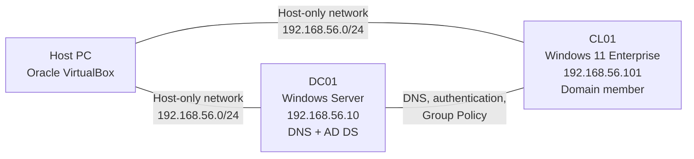

# IT Help Desk Home Lab

A portfolio project built with Oracle VirtualBox, Windows Server, Active Directory Domain Services, and a Windows client.

## Project goals

This lab demonstrates practical entry-level IT support and Windows administration skills:

- Creating and organizing Active Directory users
- Resetting passwords
- Joining a Windows PC to a domain
- Triggering and resolving account lockouts
- Creating Organizational Units (OUs)
- Creating, linking, and validating Group Policy Objects (GPOs)
- Documenting work through screenshots and troubleshooting notes

## Lab topology



## Environment

| Component | Suggested configuration |
|---|---|
| Hypervisor | Oracle VirtualBox |
| Server VM | Windows Server 2025 Evaluation, Desktop Experience |
| Client VM | Windows 11 Enterprise Evaluation |
| Domain controller | `DC01` |
| Client computer | `CL01` |
| AD domain | `helpdesk.test` |
| NetBIOS name | `HELPDESK` |
| Lab network | `192.168.56.0/24` |
| DC/DNS address | `192.168.56.10` |
| Client address | `192.168.56.101` |

## Repository contents

- [`docs/01-lab-build-guide.md`](docs/01-lab-build-guide.md) — complete build procedure
- [`docs/02-troubleshooting.md`](docs/02-troubleshooting.md) — issue log and common fixes
- [`docs/04-project-reflection.md`](docs/03-project-reflection.md) — portfolio reflection template
- [`scripts/Create-LabObjects.ps1`](scripts/Create-LabObjects.ps1) — optional AD object creation script
- [`scripts/Verify-Lab.ps1`](scripts/Verify-Lab.ps1) — validation and evidence report
- [`PROJECT-CHECKLIST.md`](PROJECT-CHECKLIST.md) — completion tracker

## Recommended OU design

```text
helpdesk.test
└── Lab
    ├── Users
    │   ├── HR
    │   ├── Sales
    │   └── IT
    ├── Computers
    │   └── Workstations
    └── Groups
```

## Demonstration accounts

| User | Username | Department |
|---|---|---|
| Alice Johnson | `ajohnson` | HR |
| Bob Smith | `bsmith` | Sales |
| Carol Lee | `clee` | IT |

Never commit real credentials, ISO files, VM disks, recovery keys, or exported production policies.

## Suggested final screenshots

1. VirtualBox showing both VMs
2. DC01 static IPv4 and DNS configuration
3. Successful AD DS installation
4. OU hierarchy in Active Directory Users and Computers
5. Created user accounts
6. CL01 computer account in the Workstations OU
7. Domain join success message
8. Domain user signed in to CL01
9. Password reset action
10. Locked account and successful unlock
11. GPO linked to an OU
12. `gpresult /r` or `gpresult /h` showing applied policy
13. Visible policy result on CL01
14. Final PowerShell verification report

Place evidence in `evidence/screenshots/` using the filenames in the screenshot checklist.

## Resume-ready summary

> Built an isolated Windows domain lab in Oracle VirtualBox using Windows Server and Windows 11. Configured AD DS and DNS, created an OU hierarchy and user accounts, joined a client PC to the domain, performed password resets and account unlocks, and deployed and validated Group Policies. Documented the implementation with screenshots and troubleshooting notes in GitHub.

## Status

- [x] VirtualBox network created
- [x] Domain controller installed
- [x] AD DS and DNS configured
- [x] OUs, groups, and users created
- [x] Client joined to the domain
- [x] Password reset tested
- [x] Account lockout tested
- [x] GPOs applied and verified
- [x] Screenshots added
- [x] Troubleshooting notes completed
